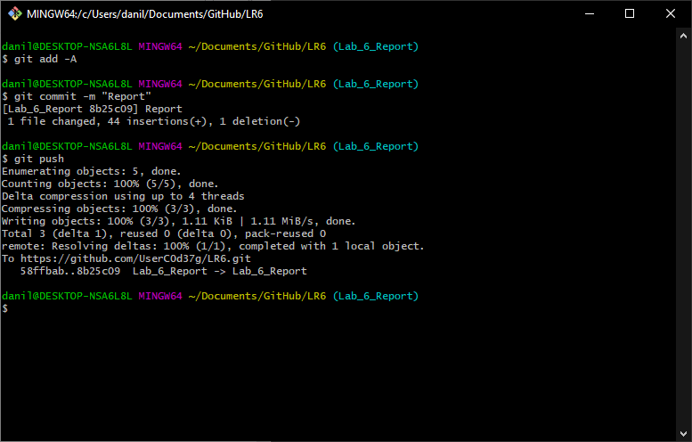
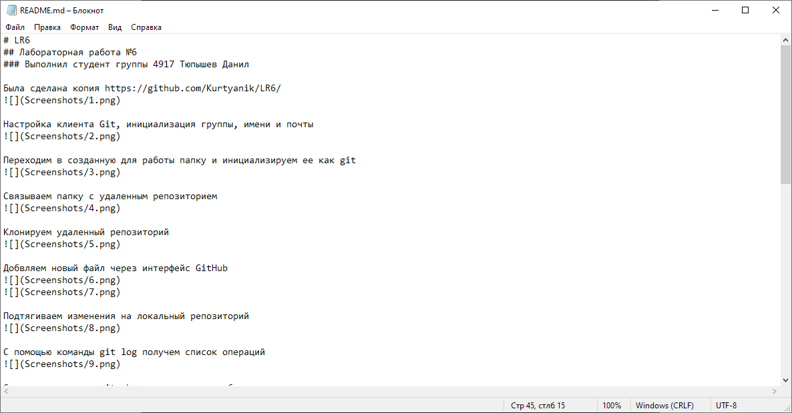
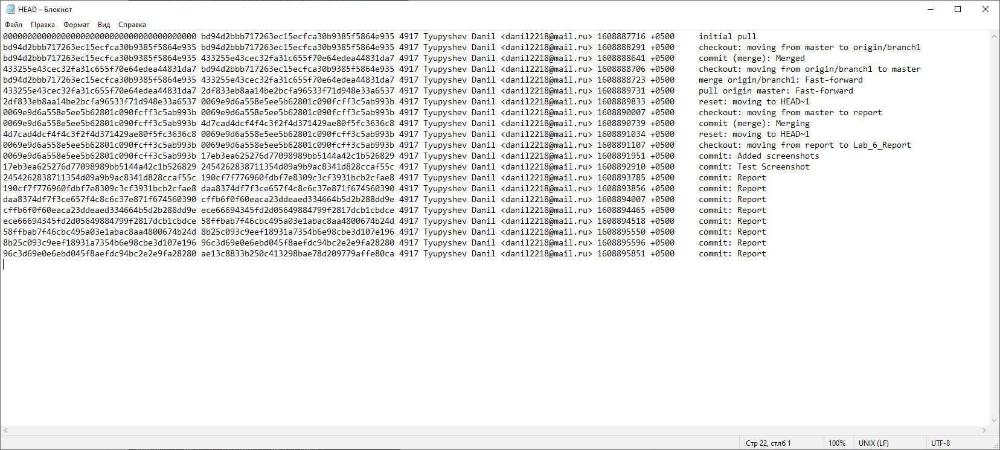

# LR6
## Лабораторная работа №6
### Выполнил студент группы 4917 Тюпышев Данил
### Ход работы

Была сделана копия https://github.com/Kurtyanik/LR6/

Настройка клиента Git, инициализация группы, имени и почты

Переходим в созданную для работы папку и инициализируем ее как git

Связываем папку с удаленным репозиторием

Клонируем удаленный репозиторий

Добвляем новый файл через интерфейс GitHub

Подтягиваем изменения на локальный репозиторий

С помощью команды git log получем список операций

С помозью команды git show открываем подробности коммита

Переходим в ветку branch1 и пытаемся выполнить слияние

Из за конфдикта не удается выполнить слияние.
Повторяем операцию после исправления.

Удаляем побочную ветку

Отправляем изменения на удаленный репозиторий

Создаем еще несколько файлов на удаленном репозитории

Подгружаем изменения в локальный репозиторий

Вывод git log

Выполняем "Hard" откат

Отпраляем обновления

С помощью команды git checkout -b Lab_6_Report создаем ветку для отчета

Отправляем в локальный репозиторий папку со скриншотами и отправляем обновления в удаленную ветку

Пишем отчет в файле README.md используя блокнот

История операций в форматированном виде из файла HEAD из .git/logs
